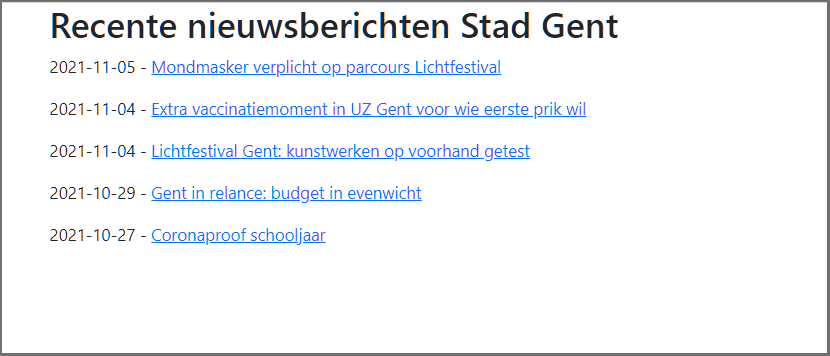
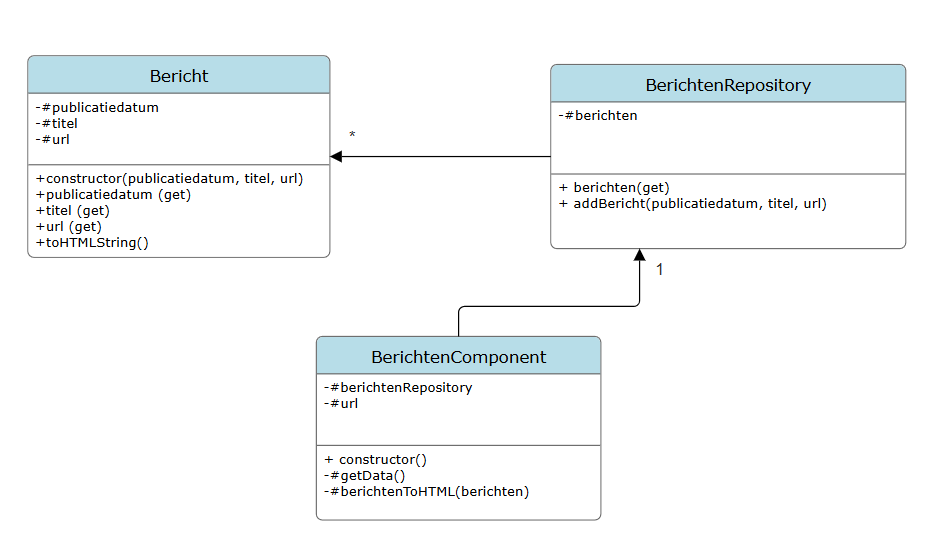
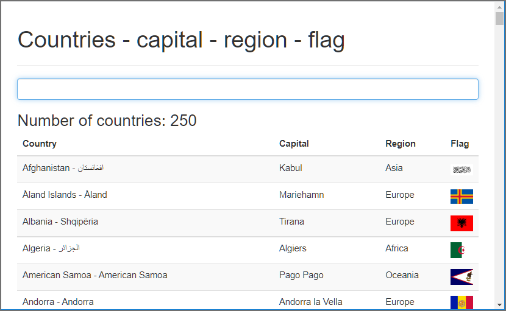
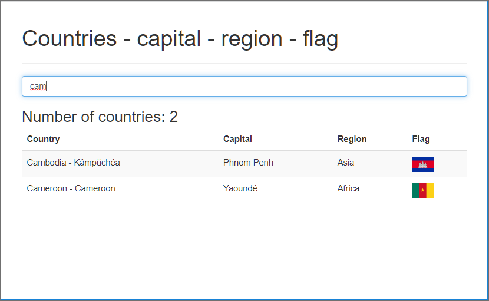
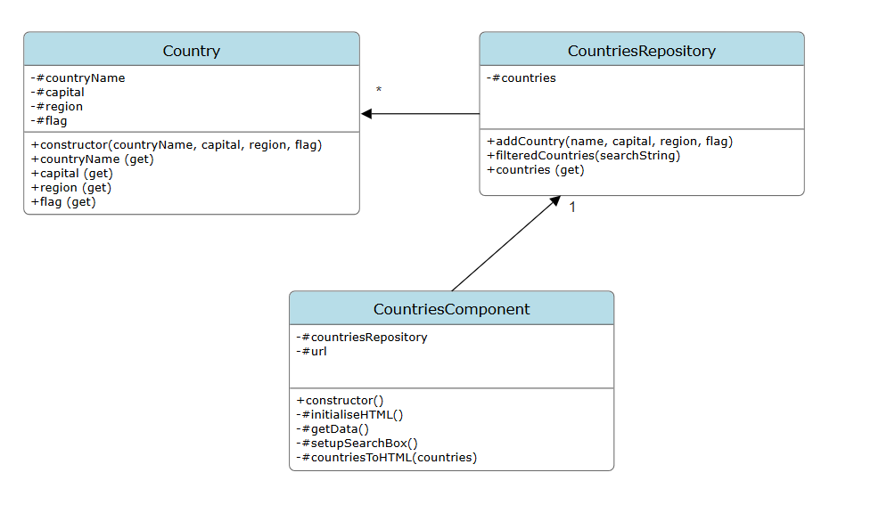
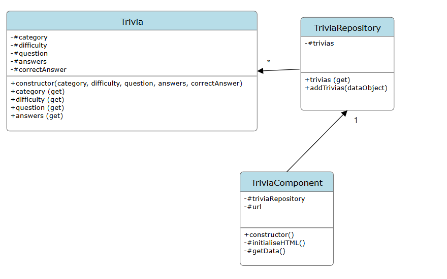
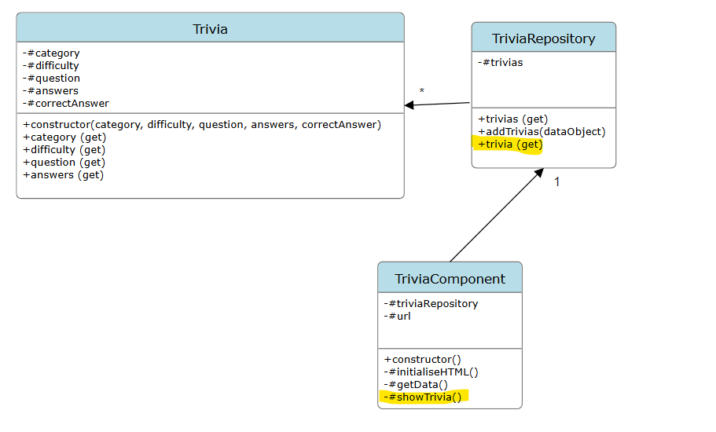
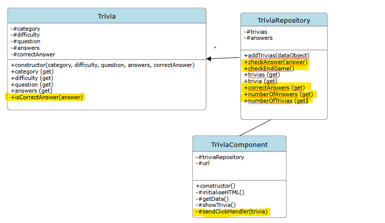
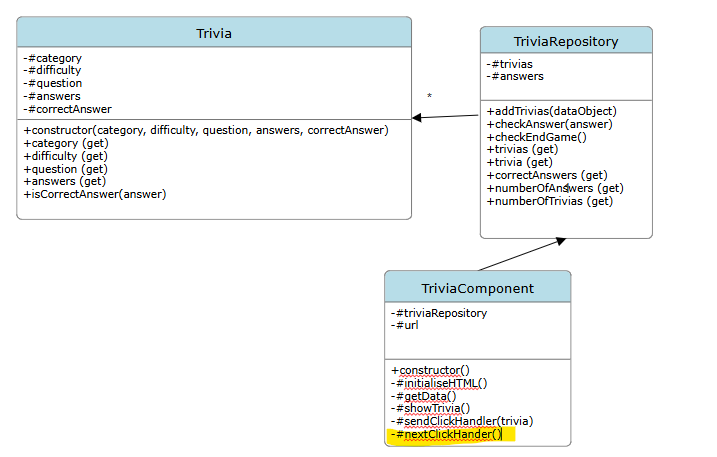

# 08exAsynchronous_JavaScript

## Oefening 1: Nieuwsberichten Stad Gent

Surf naar [https://data.stad.gent/](https://data.stad.gent/) en zoek daar de url op om de vijf laatste nieuwsberichten van de
stad Gent op te vragen in JSON-formaat.

Bij het openen van de webpagina index.html moeten de publicatiedatum en de titel afgebeeld worden van deze 5 nieuwsberichten. Maak van elke titel een hyperlink die verwijst naar de webpagina met het volledige nieuwsbericht.

Gegeven onderstaand klassendiagram, implementeer deze applicatie.

- Maak een klasse `Bericht`. De methode toHTMLString() genereert html: een paragraaf tag die de publicatiedatum - de titel met de link naar het nieuwsbericht bevat
- Maak een klasse `BerichtenRepository`. De repository bevat de 5 berichten. Aan de hand van de methode addBericht() wordt een bericht aan de repo toegevoegd
- Maak een klasse `BerichtenComponent`. Zorg ervoor dat in de constructor de correcte url wordt toegekend om de data op te halen, de repo wordt geïnstantieerd en de data wordt opgehaald. De methode #getData() haalt de data op. Werk met de Fetch API maar zonder gebruik te maken van async/await. De methode #berichtenToHTML() zorgt voor het weergeven van de nieuwsberichten op de webpagina.

Importeer `BerichtenComponent` in `index.js` en zorg ervoor dat de applicatie wordt gestart.

## Oefening 2: cookieStore

De Cookie Store API is een asynchrone en promise-based API. Controleer [de browser compabiliteit](https://developer.mozilla.org/en-US/docs/Web/API/CookieStore#browser_compatibility).

De start-bestanden bevatten reeds de code (functie init) om één cookie te creëren, die binnen één dag vervalt. Nadat de cookie gecreëerd is wordt er ook een boodschap getoond met addMessage().

Pas de code aan zodat er parallel twee cookies gecreëerd worden.

Nadat de twee cookies gecreëerd zijn toon je de boodschap 'cookie1 en cookie2 created' (met behulp van addMessage()) en stel je de event handlers voor de knoppen in.

De code voor de event handlers van de knoppen 'Haal de waarde op van cookie2' =>`cookieStore.get('cookie2')` en 'Toon alle Cookies' =>`cookieStore.getAll()` zal opnieuw promise-based zijn. Ook hier is het de bedoeling dat je geen gebruik maakt van async/await.

De code voor de knop 'Wis de berichten' is simpel. Hier gebruik je de helpers module.

## Oefening 3: Countries

Bij het openen van de webpagina moeten alle 250 landen weergegeven worden (/data/countries.json).

Via het tekstvak moet de gebruiker kunnen filteren:

Het aantal landen plaats je op de webpagina in het div-element `#number` de landen zelf in `#countries`.

Je werkt met vier modules: index.js (entry point van de applicatie), en 1 module voor elk van de onderstaande klassen

Stap 1 : Ophalen van de landen en weergave in de browser

- Zorg ervoor dat `index.js` de applicatie start.

- Implementeer de klasse `Country` in de file country.js.
  Een Country-object bevat countryName, capital, region en flag.
  Exporteer de klasse en importeer ze in de file countriesRepository.js.

- Implementeer in de klasse `CountriesRepository` de methode addCountry() die een nieuw Country-object creëert en toevoegt aan de array #countries. Exporteer de klasse CountriesRepository en importeer ze in countriesComponent.js.

- Implementeer de klasse `CountriesComponent` :

  - Zorg ervoor dat de constructor de url instelt om de data op te halen: /data/countries.json, een instantie van de repo aanmaakt en de methode #initialiseHTML aanroept
  - De methode #getData() moet op basis van de url de repository opvullen. Maak bij deze methode gebruik van async/await. Hierbij moet 'countryName' zowel de 'name' als de 'nativeName' uit de objecten van de API bevatten. Zo moet de 'countryName' voor Duitsland de string 'Germany - Deutschland' zijn.
  - De methode #initialiseHTML() roept de methode #getData() op en zal eens de landen zijn opgehaald, de landen moeten weergeven op de webpagina (roep hiervoor de methode #countriesToHTML aan)
  - Implementeer de methode #countriesToHTML. Log eerst de countries-array uit de countriesRepository naar de console. Run de applicatie en controleer of de countries-array in de console worden weergegeven. Pas dan deze methode verder aan zodat de countries-array in een tabel wordt afgebeeld op de webpagina.

  Start je applicatie en controleer of alle landen worden weergegeven op de webpagina.

Stap 2: Zoeken

- Implementeer in de `CountriesRepository` klasse de methode filteredCountries(searchstring) die een gefilterde landen-array teruggeeft op basis van een zoekString.

  Een searchstring='be' betekent dat de gefilterde landen-array alle landen moet bevatten die beginnen met 'be'. Je werkt case-insensitive.

- In de klasse `CountriesComponent`: maak gebruik van de methode #setupSearchBox() die de event handler voor de search box instelt.
  Roep de methode op in #initialiseHTML() en controleer of alles correct werkt.

## Oefening 4: Trivia quiz.

Dit is een oefening op Fetch, promises en de DOM API.

Deze oefening stelt 10 Trivia (trivial pursuit) vragen met enkele mogelijke antwoorden na elkaar.

Nadat de 10 vragen gesteld zijn en een antwoord op elke vraag gegeven is, eindigt de quiz.

De vragen worden één per één op het scherm getoond met de mogelijke antwoorden. Nadat één antwoord gekozen is, bevestig je je antwoord door op de knop 'submit answer' te klikken. Vervolgens wordt het juiste antwoord getoond en het aantal reeds gestelde vragen en juiste antwoorden boven de vraag weergegeven.
Vervolgens kan men op de knop 'next question' klikken en verschijnt de volgende vraag.
Nadat de tien vragen gesteld en beantwoord zijn wordt de knop disabled en is de quiz gedaan.

De vragen voor deze quiz worden random opgevraagd via de volgende api: [Open Trivia Database ](https://opentdb.com/). Bekijk de api en tracht de juiste url te bepalen die nodig is om 10 random vragen uit de database op te vragen.

Voorbeeld van het verloop van de quiz:
Vraag 5 wordt getoond met de mogelijke antwoorden.

Vraag 5 is beantwoord en er is op de 'submit answer' knop geklikt.

Na het klikken op de knop 'next question' wordt vraag 6 met mogelijke antwoorden weergegeven.

Nadat de tiende vraag is beantwoord, blijft de laatste vraag met antwoord zichtbaar, maar is de knop disabled.

Voor de opmaak en layout wordt gebruik gemaakt van [Materializecss](https://materializecss.com/), het moet niet altijd bootstrap zijn!!

Bekijk heel grondig de HTML (hoeft niet gewijzigd te worden).

We implementeren de code in verschillende stappen.

STAP 1. Ophalen van de trivias en weergave in de console

- Implementeer `index.js` zodat de applicatie opstart.
- klasse `Trivia`. Deze bevat reeds de private attributen en de getters.
- klasse `TriviaRepository`. Deze zal de 10 random trivia bijhouden en de nodige methodes voorzien om de TriviaComponent te kunnen uitvoeren (zie verder), maw om de quiz te kunnen spelen. De TriviaRepository bevat:
  - #trivias: houdt de 10 trivia vragen bij
  - trivias (get): retourneert `#trivias`.
  - addTrivias(dataObjecten) mapt de dataObjecten (bekomen met de Fetch API) naar Trivia objects en voegt ze toe aan de trivia's array. Bekijk een mogelijke response van de api in het bestand 'exampleResponseApi.json': hier zie je dat het juiste antwoord (correct_answer) en de foute antwoorden (incorrect_answers) twee verschillende properties zijn. In een Trivia object moet 'answers' alle mogelijke antwoorden bevatten, dus het correcte antwoord en de foute antwoorden. Implementeer.
- klasse `TriviaComponent`:
  - heeft uiteraard een TriviaRepository object #triviaRepository nodig evenals de url #url om de data op te halen
  - constructor : bekijk de code
  - #getData(): haal met behulp van de Fetch API de 10 Trivia op bij de Web api. Hou de 10 trivia's bij in #triviaRepository(via de methode `addTrivias`). Als dit mislukt geef een melding in de div tag met id `answer`.
  - #initialiseHTML: haal de 10 trivia's op (`#getData`) en geef de opgehaalde trivias voorlopig weer in de console

STAP 2. Weergave van de eerste trivia in de webpagina.

- klasse `TriviaRepository`.
  - de getter `trivia` dient momenteel de eerste trivia te retourneren. Later passen we de getter aan en halen we de volgende trivia op.
- klasse `TriviaComponent`
  - methode #showTrivia : bekijk de code. Roep deze methode aan in `#initialiseHTML()`;

Voer de code uit. De eerste trivia wordt weergegeven.

STAP 3. Klik op de Submit answer knop en controleer of het antwoord klopt.

- klasse `Trivia`.
  - Implementeer de methode 'isCorrectAnswer(answer)', deze retourneert een boolean.
- klasse `TriviaRepository`.
  - van de antwoorden houden we in de array '#answers' bij of het antwoord al dan niet correct was (true of false).
  - numberOfAnswers: geeft het aantal reeds gegeven antwoorden terug
  - correctAswers: geeft het aantal reeds gegeven correcte antwoorden terug. Tel het aantal voorkomens van true in de array '#answers'.
  - numberOfTrivias: geeft het aantal vragen terug
  - checkAnswer(answer): retourneert true of false naargelang het antwoord op de huidige trivia (gebruik hiervoor de getter trivia) al dan niet correct is en voegt dit toe (true of false) aan de collection van answers.
  - checkEndGame(): retourneert true or false naargelang de quiz al dan niet ten einde is. De quiz is ten einde als het aantal Trivia gelijk is aan het aantal gegeven antwoorden.
- klasse `TriviaComponent`
  - #showTrivia : Roept de methode #sendClickHandler aan als op de 'send' knop geklikt wordt. Bekijk de code
  - #sendClickHandler: zal het antwoord controleren, het correcte antwoord weergeven evenals het aantal correcte antwoorden en het aantal reeds gegeven antwoorden. De next knop wordt weergegeven als niet einde spel. De methode is reeds gedeeltelijk geïmplementeerd. Implementeer zelf nog volgende items:
    - controleer of het antwoord correct was
    - implementeer het weergeven van het aantal reeds correcte antwoorden tov. het totaal aantal gegeven antwoorden (span met id="correct")
    - implementeer het weergeven van het correcte antwoord (div met id="answer")

Voer de code uit

STAP 4. Ophalen van de volgende trivia en de weergave van de trivia en aantal reeds gestelde vragen in de browser

- klasse `TriviaRepository`
  - de getter trivia retourneert de volgende trivia. Maak hiervoor gebruik van het aantal gegeven antwoorden ('numberOfAnswers')
- klasse `TriviaComponent`
  - #showTrivia : Bekijk de code. Implementeer nog het weergeven van het aantal reeds gestelde vragen tov het totaal aantal vragen (span met id="question")
  - #nextClickHander: geeft de volgende trivia weer. Bekijk de code

Voer de code uit.

## Oefening 5: FilmBrowser.

Dit is een oefening op Fetch, promises en de DOM API.

Deze oefening laat de gebruiker een zoekterm ingeven. Na het klikken op de 'Search' button krijgen we de 10 meest relevante films voor de zoekterm te zien. Zorg voor een gepaste boodschap, indien geen zoekterm is ingegeven of als er iets fout gaat bij het ophalen van de data. Voor elke film kan op de image geklikt worden en worden de details van de film getoond. Bij de detailview klik je op de image om terug te keren naar de zoekresultaten.

De films worden opgevraagd via de volgende api: [Open Movie Database ](http://www.omdbapi.com/). Om deze database te raadplegen heb je een key nodig (deze is gratis). Indien je geen key aanvraagt, kan je volgende key gebruiken: 'apikey=57927523'. Vraag toch je eigen key aan want per key is er een gelimiteerd aantal request per dag. Bekijk de api en tracht de juiste url's te bepalen die nodig zijn om films op te vragen en een film (detail) op te vragen via het id van de film: voor beide heb je een request naar de api nodig.

Start applicatie:

Resultaat na zoekterm 'star' ingeven en op search knop klikken.

Detail film:

Indien geen poster beschikbaar is (poster: N/A) wordt de 'No Image Available' afbeelding (zie map images) weergegeven.

Het klassendiagram

Implementeer de applicatie in stapjes, en controleer telkens het resultaat. De uitleg over de methodes kan je hieronder vinden.

- Stap 1: Ophalen van de films gegeven de zoekterm en weergave van het resultaat in de console
- Stap 2: Weergave van de gevonden films in de browser
- Stap 3: Ophalen van de detail van een film bij klik op een film en weergave in de console
- Stap 4: Weergave van de detail van een film in de browser

Voor de opmaak en layout wordt opnieuw gebruikgemaakt van [Materializecss](https://materializecss.com/).

Bekijk heel grondig de HTML (hoeft niet gewijzigd te worden).

`index.js` start de applicatie.

De klasse `Film` met de gepaste getters. Deze klasse heeft een property detail, om de details van een film op te slaan (data ontvangen via een tweede request naar de api).

De klasse `FilmRepository`. Deze zal de films bijhouden en de nodige methodes voorzien om de FilmBrowserComponent te kunnen uitvoeren (zie verder), maw om de film database te bevragen en weer te geven.

- de films worden bijgehouden in de #films array.
- addFilms(dataObjecten) mapt de dataObjecten (van api) naar Film objects en voegt ze toen aan de array.
- addDetail(id,objDetail): haalt het juiste film Object op uit de array en voegt de details toe (zie screenshot detail en detail property van film object).
- getFilmById(id): retourneert film overeenkomstig het id (parameter).

De klasse `FilmBrowserComponent`.

Deze bevat alle members en methods om de externe film database te bevragen en de films weer te geven en ook de details van de aangeklikte film weer te geven.

- Deze klasse heeft uiteraard een FilmRepository object nodig en moet de data ophalen: #searchFilms(searchText). hij maakt hierbij gebruik van de volgende url: http://www.omdbapi.com/?s=zoekterm&apikey=57927523, waarbij de zoekterm vervangen wordt door de ingegeven zoekterm op de webpagina.
- de methode #searchFilms(searchText) zal door gebruik te maken van de fetch API de films ophalen door de searchText mee te geven in het api request te halen:
  - indien dit succesvol gebeurt worden
    - de Objecten, indien er een zoekresultaat is, van de api toegevoegd als Film Objecten aan de array van de repository, gebruik hiervoor de method 'addFilms(dataObjecten)' van het filmRepository object. Vervolgens worden deze weergegeven op de pagina, #showFilms() method.
    - een gepaste boodschap gegeven - #showMessage(message) method, indien geen zoekresultaat is.
  - indien dit niet succesvol gebeurt, dan wordt een gepast bericht naar de console (dit mag eventueel ook via een alert of op de webpagina zelf) gestuurd.
- de methode #getFilm(id) zal, nadat op de knop details van een film is geklikt, de details data ophalen bij de api via een http request (url: http://www.omdbapi.com/?i=idFilm&plot=full&apikey=57927523, waarbij idFilm wordt vervangen door het id als argument meegegeven).
  - indien dit succesvol gebeurt, worden
    - de filmdata, indien er een zoekresultaat is, van de api toegevoegd als Film object details aan de overeenkomstige film uit de repository, gebruik hiervoor de method 'addDetail(id, objDetail)' Vervolgens wordt de film weergegeven op de pagina ,#showDetailFilm(film) method.
    - een gepaste boodschap gegeven - showMessage(message) method, indien geen zoekresultaat is.
  - indien dit niet succesvol gebeurt, dan wordt een gepast bericht naar de console (dit mag eventueel ook via een alert of op de webpagina zelf) gestuurd.
- de methode #showFilms() zal de films op de webpagina weergeven. Elke film bevat een knop om de details te bekijken. Implementeer het click event en roep de methode #getFilm(id) aan.
- de methode #showDetailFilm(film) zal de film op de webpagina weergeven. Als er vervolgens geklikt wordt op de afbeelding van de film wordt er teruggekeerd naar het overzicht van de films - #showFilms(). Implementeer.
